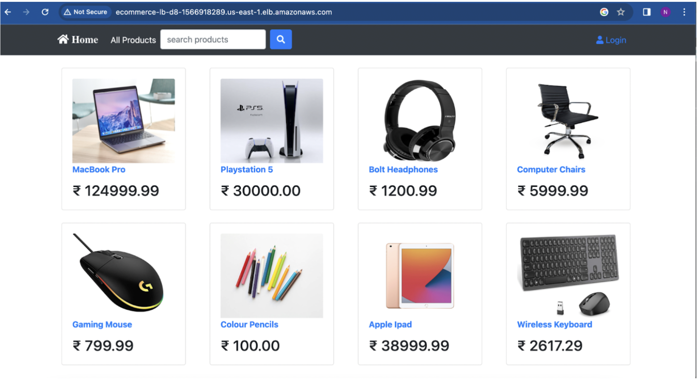
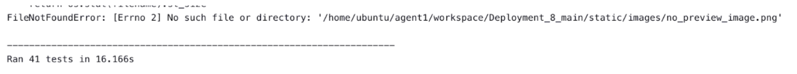
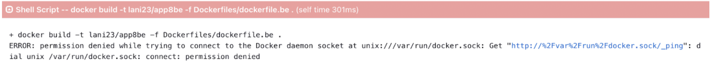
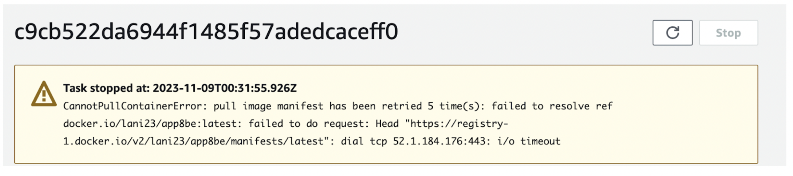
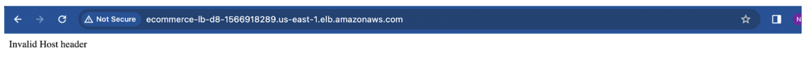

<p align="center">

</p>
<h1 align="center">C4_deployment-8<h1> 

# Purpose

This deployment demonstrates the containerization of an e-commerce application using infrastructure as code to deploy a CI/CD pipeline management infrastructure and managed container services.

Terraform is used to deploy a Jenkins manager and agent architecture using AWS cloud infrastructure. The Jenkins infrastructure leverages Terraform to deploy a VPC and resources, configure AWS ECS, and deploy container images of the frontend and backend of the e-commerce application.

## Deployment Files

The following files are needed to run this deployment:

- `management.tf` Main Terraform file to deploy Jenkins management infrastructure
- `Dockerfile.be` Dockerfile to create backend service container image
- `Dockerfile.fe` Dockerfile to create frontend service container image
- `jnk_mgr_setup.sh` Script to install required packages for running Jenkins application
- `jnk_iac_setup.sh` Script to install Terraform and required packages for Jenkins iac server
- `jnk_container_setup.sh` Script to install Docker runtime engine and required packages for Jenkins container server
- `JenkinsfileBE` Configuration file used by Jenkins to run a pipeline
- `JenkinsfileBE` Configuration file used by Jenkins to run a pipeline
- `README.md` README documentation
- `backend/` Folder housing Python, Django, and SQLite application files to run backend services
- `frontend` Folder housing Nodejs and React applications files to run frontend services
- `initTerraform/` Folder housing terraform files
- `initTerraform/vpc.tf` Terraform file to deploy application’s working environment in AWS
- `initTerraform/ecs_backend.tf` Terraform file to deploy application’s AWS ECS cluster and backend container
- `initTerraform/frontEnd/ecs_frontend.tf` Terraform file deploy frontend container and join active AWS ECS cluster

## `Steps`

1. This project exhibits the deployment of an e-commerce application using Terraform and the AWS ECS service. A Github repository was created to store the newly created Terraform files used to construct a Jenkins server/agent management infrastructure and container application infrastructure. To start, the Jenkins management terraform files were saved to the repo:

        ```bash
        Git add management.tf 
        Git commit -m “Commit Message”
        ```
    Next, a new branch was created to test the application infrastructure’s terraform files before merging to the main branch.

        ```bash
        Git branch initterraform_test
        Git checkout initterraform_test
        
        # Created/modified files:
        initTerraform/vpc.tf
        initTerraform/ecs_backed.tf
        initTerraform/variables.tf
        initTerraform/frontEnd/ecs_frontend.tf
        initTerraform/frontEnd/variables.tf
        
        git add initTerraform/
        git commit -m “commit message”
        git checkout main
        git merge initterraform_test
        git push -u origin main
	    ```
<br><br>

2. The default VPC was used as the deployment target for the Jenkins infrastructure. The deployment was initiated with the commands:

        ```bash
        Terraform init
        Terraform plan
        Terraform apply

        # Terraform output returned:
        # http://<jnk_management_server_public_ip>
        # http://<jnk_iac_server_public_ip>
        # http://<jnk_container_server_public_ip>
        ```

        In the AWS console, there should be a servers named:
        - jenkins_management_server
        - jenkins_iac_server
        - jenkins_container_server
<br><br>

3. The management is now up and running. We can log into the Jenkins Management server to set up our required pipeline configuration.
   
        ```bash
        http://<jenkins_management_server>:8080
        ```

    Retrieve initial Jenkins password from the server terminal:

        ```bash
        sudo cat /var/lib/jenkins/secrets/initialAdminPassword
        ```
    
    Install `Docker Pipeline` plugin for Jenkins. This plugin allows Jenkins pipelines to use Docker images for building and testing. 

        - From the Dashboard, go to `Managed Jenkins` > `Plugins` > `Available plugins`
        - Search: `Docker Pipeline` > `Check box` > `Install`
        - Verify installation under `Installed plugins`

    Setup two Jenkins node agents to facilitate an ssh connection between the Jenkins management server and the Jenkins agent IaC and Jenkins agent container servers. These agent servers allow Jenkins to offload pipeline jobs in an effort to optimize the deployment process. Configure the node agent by navigating to `Dashboard` > `Build Executor Status` > `New Node`:

        - Node name: `awsDeploy`
        - Select `Permanent Agent`
        - Number of executors: `1`
        - Remote root directory: `/home/ubuntu/agent1`
        - Labels: `awsDeploy`
        - Usage: `Only build jobs with label expressions matching this node`
        - Launch method: `Launch agents via SSH`
        - Host: `<jnk_agent_iac_server_public_ip>`
        - Credentials: `ubuntu`
        - Host Key Verification Strategy: `Non verifying Verification Strategy`
        - Availability: `Keep this agent online as much as possible`
        - `SAVE`

    Create another agent Node:

        - Node name: `awsDeploy2`
        - Select `Permanent Agent`
        - Number of executors: `1`
        - Remote root directory: `/home/ubuntu/agent1`
        - Labels: `awsDeploy`
        - Usage: `Only build jobs with label expressions matching this node`
        - Launch method: `Launch agents via SSH`
        - Host: `<jnk_agent_container_server_public_ip>`
        - Credentials: `ubuntu`
        - Host Key Verification Strategy: `Non verifying Verification Strategy`
        - Availability: `Keep this agent online as much as possible`
        - `SAVE

    Agents will be available a few minutes after saving. 

    Setup credentials for AWS (used by Terraform) and Dockerhub which will be required by the Jnk agent iac Jnk agent container servers, respectively. Configure the credentials by navigating to `Dashboard` > `Manage Jenkins` > `Credentials` > `System (Credentials)` > `Global credentials` > `Add Credentials`:

        - Kind: `Secret Text`
        - Scope `Global`
        - Secret:: `**AWS Access Key**`
        - ID: `AWS_ACCESS_KEY`
        - Description: `aws access key`
        - `Create`

    Repeat `Add Credentials` for AWS Secret Key

        - Kind: `Secret Text`
        - Scope `Global`
        - Secret: `**AWS Secret Key**`
        - ID: `AWS_SECRET_KEY`
        - Description: `aws access key`
        - `Create`

    Repeat `Add Credentials` for Dockerhub

        - Kind: `Username with password`
        - Scope `Global`
        - Username `lani23`
        - Password `Dockerhub Access Token`
        - ID: `lani23-dockerhub`
        - `Create`
<br><br>

4. The Dockerfile involved creating two files to facilitate the use of frontend and backend containers. In the frontend container, Nodejs and React are running to provide web content visuals to the end-user. On the backend container, Python, Django, and SQLite database is providing product and registered user info to API calls from the frontend.

    `Dockerfile FrontEnd`

        ```Golang
        FROM node:10
        RUN git clone https://github.com/kaedmond24/containerized_ecommerce_application.git
        WORKDIR containerized_ecommerce_application/frontend
        EXPOSE 3000
        RUN npm install --save-dev @babel/plugin-proposal-private-property-in-object
        RUN npm install
        CMD npm start
        ```

    `Dockerfile BackEnd`

        ```Golang
        FROM python:3.9
        RUN git clone https://github.com/kaedmond24/containerized_ecommerce_application.git
        WORKDIR containerized_ecommerce_application/backend
        RUN pip install -r requirements.txt
        EXPOSE 8000
        RUN python manage.py migrate
        CMD python manage.py runserver 0.0.0.0:8000
        ``` 

    Two Jenkinsfiles (JenkinsBE, JenkinsFE), required for running the build pipeline, were configured to deploy container service from Dockerfile.be and Dockerfile.fe, respectively.
    <br><br>

5. On the Jenkins manager server, setup of the Jenkins build pipeline can be completed.
    
    - From Dashboard, select a `new item` > `Create Name` > `Mulit-branch Pipeline` option
    - Set Branch sources:
        * Credentials: [How to setup Github Access Token](https://docs.github.com/en/enterprise-server@3.8/authentication/keeping-your-account-and-data-secure/managing-your-personal-access-tokens)
        * Repository HTTPS URL: `<Github Repo URL>`
        * Build Configuration > Mode > Script Path: JenkinsfileBE
    - `Apply` and `Save`

<br><br>

6. Here were running the build pipeline to deploy VPC and backend. After cloning the repository onto the nodes, a test stage ran, where a python virtual environment was created and discovered whether the get and post requests to the backend were successful. The build stage ran on the Jenkins agent running Docker. This stage determined whether the dockerfile was able to successfully build the image. Next, Docker logged into my Docker Hub and pushed the image to my repository. The Jenkins agent running Terraform initialized the directory with the .tf files for the application infrastructure, showed my configurations along with Terraform's, and created the infrastructure via Terraform apply for the application. The result of a successful Jenkins pipeline run will produce a DNS address to access the application.

    ```text
    Apply complete! Resources: 0 added, 1 changed, 0 destroyed.
    [0m[0m[1m[32m
    Outputs:

    [0malb_url = "http://ecommerce-lb-d8-1566918289.us-east-1.elb.amazonaws.com"
    ```

<br><br>

7. To run the frontend service, the build pipeline’s configuration was retargeted to the JenkinsFE file. From Dashboard, navigate to `*Pipeline name*` > `Configuration` > `Build Configuration` > `Mode` > `Script Path: JenkinsFE`. `Apply` and `Save`.

    Deployment Success:<br>
        <br>

## `System Diagram`

System Architecture [Link](system_design.md)

## `Issues`

When running our test stage in Jenkins, we encountered this error:
    <br>

We resolved it by adding the static/images folder to the main folder since that was where the tests were looking for the files.


This error occurred when running the build stage for the Docker image. To fix it, we had to add the docker group to the Ubuntu user and reboot the system using these commands:
    <br>

    ```bash
	sudo usermod -aG docker $USER
	sudo reboot
    ```

With our backend in a private subnet, we realized the importance of adding a NAT Gateway with an elastic IP in the public subnet after getting this error. In order for the service and task definition to create the containers, the Fargate server needed access to the Internet in order to pull the image to run on the container. <br>
    

Troubleshooting our frontend containers resulted in the creation of numerous images cached on our Jenkins agent. To resolve this, we ran docker system prune to delete unused images.<br>
    

We were able to access the e-commerce application through our containers, but using the DNS URL of the load balancer, we faced this error. This error was the result of the creation of a container using a development build rather than a production build. Therefore, the application could not be accessed externally. We fixed this issue by adding ‘DANGEROUSLY_DISABLE_HOST_CHECK=true’ to the package.json file and installing the babel dependency.

## `Optimization`

- We currently have a single point of failure. If the backend container goes down, our application will not work. We recommend adding a backup backend container to the second availability zone with the application server and replacing the SQLite database for RDS database. This will ensure that each application instance has access to the same information, improving the user experience. The RDS database should also have a synced backup.

- To scale out and manage individual services that may require different resources, we could adopt a microservices approach. Using Elastic Kubernetes Service, we could create pods for the frontend, payment API, accounts API, and product API. This will allow us to scale our infrastructure seamlessly and minimize downtime with its rollback feature.

- To avoid unauthorized people from accessing our Jenkins and Terraform instances, we suggest using a private subnet or a network control access list to ensure that IP addresses outside of our team are unable to access our state and application files.
